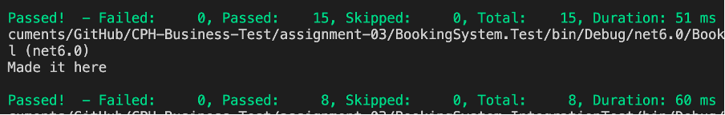

# Assignment 3 - Test - booking system

Developed by William S. Huusfeldt and Asger H. Sørensen

## Introduction

We ended up being a bit short of time, so there could of been more test than there are here now. Although what we've made should be enough to fufill the requirements of the assignment. 

We've made the assignment in c#, so we've rewritten the supplied code base into that. 

## How to run
To start the docker container with the database, run the following command: 

``` docker-compose up --build```

Thereafter, to run the test: 

``` dotnet test ``` 

Should something fail, or not be imported correctly, please clean and build

```dotnet clean```

```dotnet build```

## Result

Should look like this: 



